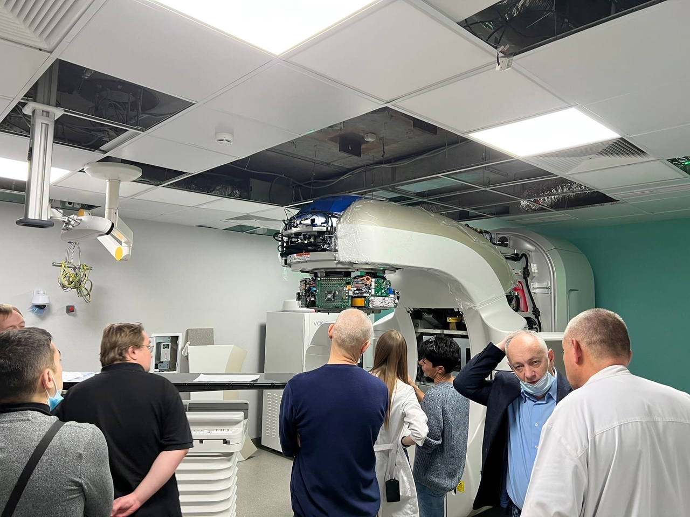
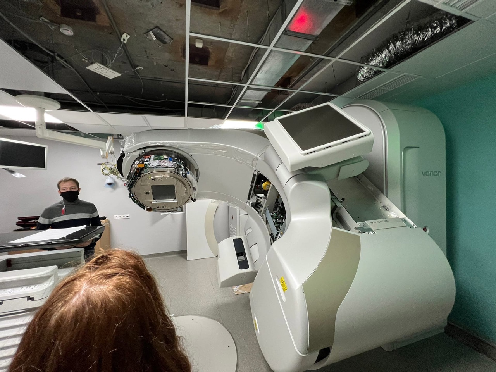

.. _excursion1:

Экскурсия в НИИ Нейрохирургии им. Бурденко
====================================================
26 ноября нами был посещен НИИ Нейрохирургии им. Бурденко, там мы увидели, чем занимается медицинский физик, насколько ответственной является
работа медецинского физика. Так же познакомились с аппаратурой лучевой терапии. Во время эксукрсии мы увидели такие аппараты , как кибернож,гамма-нож,
TrueBeam, компьютерный томограф и аппарат МРТ. Увидели как происходит планирование и оконтуривание (PVT). Нам показали, 
как важно следить за здоровьем пациента и как это происходит на практике. Например на каждом аппарает есть стоп-кнопка, которая,
при экстренных ситуациях останавливает сеанс пациента , так же объяснили насколько важно во время излучения
слдеить за другими органами пациента.Ниже привидены несколько фотографий с экскурсии.

    Обсуждение работы аппарата TrueBeam

    TrueBeam

Кибер-нож

Кибер-нож (Cyber Knife) — это современная и высокоточная система,
с помощью которой проводится безоперационное удаление опухолей, как злокачественных,
так и доброкачественных. Такое лечение бескровное и безболезненное. 
В основе работы системы заложено радиоактивное излучение, которое точечно,
с практически стопроцентной точностью, воздействует на опухолевые ткани.

Система применяется для проведения радиохирургических процедур и основана на квантовом излучении. 
С помощью этого оборудования удаляются опухоли без выполнения разрезов. 
Скальпелем является пучок радиационных лучей, точно направленных на очаг поражения. 
Лечение рака в Израиле часто проводится с помощью такого инновационного аппарата.

В состав системы входит:

линейный ускоритель — источник радиоизлучения;
робот-манипулятор, перемещающий линейный ускоритель в заданное местоположение;
рентгеновская камера, контролирующая положение больного и новообразования.
Под контролем точной работы всех составляющих системы линейный ускоритель направляет на опухоль рентгеновские лучи, 
которые уничтожают клетки рака, не касаясь здоровых тканей.

По сравнению с другими радиохирургическими системами кибер-нож обладает таким важным преимуществом, 
как обеспечение точности и адаптация оборудования к положению тела пациента. При использовании этой системы 
не применяются навигационные рамки для ограничения подвижности. Такая особенность аппарата дает возможность 
успешно удалять новообразования, находящиеся в движении в силу анатомических особенностей пораженного органа, к примеру, легкое.
Продолжительность лечения на установке кибер-нож — 30-120 минут, количество сеансов зависит от сложности диагноза, типа опухоли — от 1 до 5 сеансов. Лечебные сеансы проводятся с перерывами, в это время пациент может находиться вне клиники и, если ему позволяет состояние здоровья, может посвятить свободное время экскурсиям или отдыху на израильских курортах.

Лечебная процедура начинается только после проведения подготовительных мероприятий, которые проводятся в течение 1-2 дней. Сначала онколог-радиотерапевт проводит консультацию и направляет пациента на обследование — МРТ, ПЭТ-КТ. Результаты этих обследований специалист вводит в программу системы кибер-нож, которая создает 3D-картинку опухоли.

Далее  определяется точное место воздействия, угол наклона,
интенсивность и дозу излучения для установки. Также определяется количество сеансов и их продолжительность.
Затем специалисты наносят на тело пациента маркеры, которые в процессе лечения установка 
кибер-нож будет использовать для коррекции интенсивности и направленности пучка ионизирующих лучей.
Аппарат это делает каждый раз, как только опухоль изменяет свое положения.

+ фотка
  
Гамма-нож
Современный Гамма-Нож - это высокотехнологичное компьютеризированное устройство в котором используются самые новейшие достижения медицинской радиологии, нейрохирургии и робототехники.

Подобно нейрохирургической операции, процедура лечения проводится однократно, однако при этом отсуствуют разрезы кожи и нет необходимости проводить трепанацию черепа.

Излучение от 196 источников Со60 проходит через отверстия в коллиматорных шлемах к выбранной целевой точке. 
При этом излучение каждого отдельного пучка не оказывает повреждающего действия на мозг, но сходясь в изоцентре, 
они создают высокую суммарную дозу, достаточную для гибели опухоли или облитерации сосудистой мальформации. 
Точность наведения составляет менее 0,5 мм,
что полностью исключает облучение здоровых тканей мозга и всего тела.
Гамма-нож позволяет за один сеанс подводить к облучаемой зоне дозу облучения в десятки Грэй (1 Гр = 100 рад). 
При этом, максимум этой дозы расположен внутри мишени, 
а на границе облучаемого очага со здоровыми тканями происходит резкое падение (градиент) дозы, вследствие чего на прилежащие 
ткани приходится мизерная, безопасная доза радиации. Радиобиологический эффект радиохирургии заключается в повреждении 
генетического аппарата опухолевых клеток, в результате чего они теряют способность к делению и дальнейшему увеличению опухолевой 
массы. При радиохирургии злокачественных опухолей обычно применяются более высокие дозы облучения (15-25 Гр по краю очага с максимумом 
до 30-50 Гр). 
Это приводит не только к подавлению митотической активности клеток, но и к их быстрой гибели.

+ фотка
   

TrueBeam

Система лучевой терапии TrueBeam – это метод лечения раковых опухолей, основанный на способности линейного ускорителя TrueBeam, 
воздействовать на клетки большими дозами ионизирующего излучения. 
Его главным преимуществом является простота использования, 
избирательность действия и скорость достижения стойкой долго длящейся ремиссии.
Лучевая терапия TrueBeam значительно превосходит по силе воздействия и безопасности все известные современной медицине классические методы. 
Данную систему выгодно отличает:

Комбинированный состав – одной из ее самых интересных отличительных черт является то, 
что она состоит из комбинации нескольких современных методов лучевого лечения (IMRT, IGRT, Gated RT, Rapidarc);

Возможность локального воздействия на необходимый участок – система TrueBeam отличается феноменальной 
точностью облучения, что достигается новейшей системой визуализации;

Практически полное отсутствие доказанных побочных эффектов – благодаря большой точности 
облучения (отклонение не превышает одного миллиметра) существенно снижается вероятность появления сопутствующего повреждения здоровых тканей;

Быстрое выздоровление – благодаря точному и мощному воздействию, значительно уменьшается количество времени необходимого для достижения первых существенных результатов;

Высокая эффективность – прохождение даже одного курса терапии позволяет добиться не только стойкой ремиссии, но и в некоторых случаях полностью излечить заболевание;

Щадящее воздействие на организм – терапия не требует употребления токсичных химических препаратов и проведения хирургических операций;
Не требует госпитализации – TrueBeam практически не провоцирует возникновения побочных эффектов, что позволяет избежать помещения пациента в стационар.

 