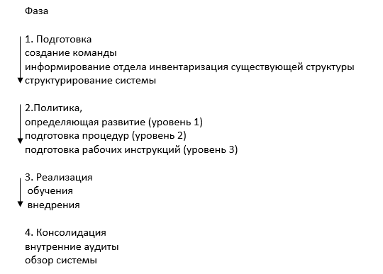
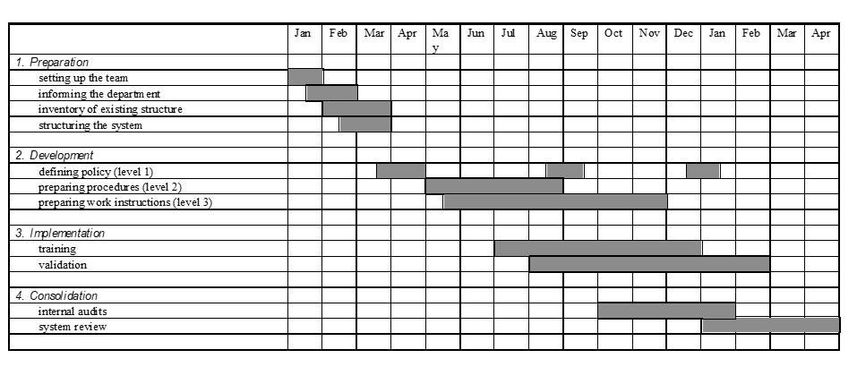
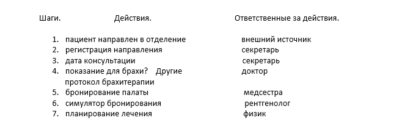

.. _QA1:

Медицинская физика и профессия медицинский физик.
=======================================================

Что такое медицинская физика?
~~~~~~~~~~~~~~~~~~~~~~~~~~~~~~~~~

Медицинская физика в основном представляет собой приложение физических подходов,
теории и методов в медицине или здравоохранении. Она включает в себя пять подзадач:

1) Терапевтическая медицинская физика
 
2) Диагностическая медицинская физика 

3) Ядерная медицинская физика

4) Медицинская физика "здоровья" 

5) Магнитно-резонансная томография.

Для практики в каждой из областей необходимо обладать докторской степенью в области физики,
медицинской физики, биофизики или пр. Также необходимо быть сертифицированным в определенной(-ых) областях.

Одной из главных задач медицинского физика является контроль качества.
(или система качества / quality assurance – система задач, требований и предложений, направленная на улучшения)
Приведем пример важности системы качества в лучевой терапии.
Лучевая терапия — это многопрофильная специальность, включающая сложное оборудование и процедуры. Общая цель разработки системы качества в отделении лучевой терапии состоит в том, чтобы предоставить официальную письменную схему для обеспечения того, чтобы все важные аспекты обеспечения качества в отделении были определены, задокументированы, поняты и применены на практике
Использование методов Монте-Карло в лучевой терапии.

Существуют два наиболее требовательных к точности лечения аспекта - контроль опухолей и осложнения в нормальных тканях.
Это, в свою очередь, приводит к высоким запросам по обеспечению качества и контролю качества на всех этапах,
процессах и оборудовании, способствующих этому.
Комплексный подход предпочтителен, поскольку признается, 
что частичной организации только некоторых ключевых этапов процесса лучевой терапии недостаточно для того,
чтобы гарантировать пациентам - и обществу - что каждый человек получит наилучшую доступную медицинскую помощь при своем заболевании.
Относительно легко проиллюстрировать роль систем качества в снижении вероятности аварий и ошибок,
взяв примеры аварий, подробности которых находятся в открытом доступе, и задав вопрос, произошла бы каждая авария,
если бы система качества была на месте.

Для осуществления и поддержания эффективной программы обеспечения качества необходимы достаточные ресурсы. Это включает в себя три компонента: персонал, необходимое оборудование и время для выполнения конкретных задач, связанных с качеством, включая аудит качества, а также для обеспечения непрерывного профессионального образования и т. д.

Потребуется время для разработки системы качества путем анализа существующей программы обеспечения качества в департаменте и существующей документации, выявления пробелов и написания политики, процедур и т. д. в едином формате, как того требует внедряемая система. Это время, как правило, будет продуктивным с точки зрения выявления пробелов в существующих гарантиях качества и в новых каналах связи, которые открываются в результате этого мероприятия. Если все группы персонала будут вовлечены в подготовку системы, то система не только будет принята с большей готовностью из-за чувства взаимной ответственности, но и процесс должен быть более быстрым и вполне может сам по себе поднять моральный дух.

После этого требуется постоянный уровень ресурсов для обеспечения поддержки системы качества и ее эффективности.

Процедуры и техники в лучевой терапии
~~~~~~~~~~~~~~~~~~~~~~~~~~~~~~~~~~~~~~~~~~~~~~~~~~~~

Также нами были изучены специальные процедуры и техники в лучевой терапии,
используемые в клиниках и специальных департаментах для уникальных процедур. Одна из проблем этих техник в том, что они
требуют обновления и модификации. Также они нуждаются в гарантийном «обслуживании».
Есть специализированная категория для техники лучевой терапии.

● Stereotactic irradiation;

● Total body irradiation (TBI) with photon beams;

● Total skin electron irradiation (TSEI);

● Intraoperative radiotherapy (IORT);

● Endorectal irradiation;

● Conformal radiotherapy and intensity modulated radiotherapy (IMRT);

● Image guided radiotherapy (IGRT);

● Respiratory gated radiotherapy;

Positron emission tomography (PET)/computed tomography (CT) fused images.

Stereotactic irradiation; Стереотактическое излучение

Это термин, который используется для описания методов фокального облучения. Там используют пучки фотонов. С помощью фотонов доставляется доза ионизации в точку поражения, в большей части используют для мозга.
Некоторые характеристики

· Предписанная доза 10-50 Гр на объем 1-35 см3

· Требования к позиционной и числовой точности - ±1 мм и ±5%

· Доза стереотаксического облучения может быть получена посредством стереотаксической имплантации радиоактивных источников (стереотаксическая брахитерапия) или,
чаще всего, с помощью одного или нескольких внешних источников излучения (стереотаксическое внешнее лучевое облучение).

· Что касается фракционирования дозы, стереотаксическое внешнее лучевое облучение
(SEBI) делится на две категории:

— Стереотаксическая радиохирургия: общая доза вводится за один сеанс.

— Стереотаксическая лучевая терапия: как и в стандартной лучевой терапии, общая доза
доставляется в нескольких долях.

· С технической точки зрения, по существу, нет разницы между
стереотаксической радиохирургией и стереотаксической радиотерапией, и часто
термин "радиохирургия" используется для описания обеих методик.

· По существу, любой пучок излучения, который был признан полезным для внешней
лучевой терапии, также нашел применение в радиохирургии (кобальтовые гамма-лучи, рентгеновские лучи мегавольтного напряжения, пучки протонов и тяжелых заряженных частиц и даже нейтронные пучки).

· Радиохирургическая техника

Гамма нож

Включает в себя 201 60Co, размещенный в центральном корпусе прибора.

· TOTAL BODY IRRADIATION

это специальная лучевая терапия, которая обеспечивает
всему телу пациента равномерную дозу в пределах ±10 % от предписанной дозы.
Для этой цели используются фотонные лучи мегавольтного напряжения, либо лучи 60Co g, либо рентгеновские лучи мегавольтного
напряжения.

· TOTAL SKIN ELECTRON IRRADIATION

это специальная радиотерапевтическая методика, которая направлена на облучение всей кожи
пациента предписанной дозой облучения, при этом избавляя все остальные
органы от любой заметной дозы облучения. 

· INTRAOPERATIVE RADIOTHERAPY

это специальная лучевая терапия, которая обеспечивает за один
сеанс дозу облучения порядка 10-20 Гр на подвергнутый хирургическому воздействию
внутренний орган, опухоль или ложе опухоли.
Можно облучить тремя способами

1)Рентгеновские лучи ортогонального напряжения;

2)Электронные пучки мегавольтного напряжения;

3) Источники брахитерапии с высокой мощностью дозы (HDR) 192Ir.

· CONFORMAL RADIOTHERAPY

здесь используются некоторые методы доведения большей дозы до опухоли, не повреждая другие органы и кожу

· IMAGE GUIDED RADIOTHERAPY

Здесь происходит визуализация, например объема опухли, то есть на визуализации более четко можно разобраться как лечить пациента, какой дозой и тд. Этот метод до сих пор развивается.

· RESPIRATORY GATED RADIOTHERAPY

Этот метод связан тем, как донести нужную дозу, до нужного органа, если у пациента всегда происходит дыхательные движения. Эту проблемы решает именно этот метод,

Сделаем выводы, что медицинский физик должен хорошо представлять себе,
что такое система качества, потому что система качества - некий фундамент,
на котором строится лучевая терапия или лечение онкозаболеваний.
Она обеспечивает не только постоянный контроль квалифицированного подхода к лечению,
но и непрерывное повышение "качества" лечения (выявляя недостатки, вводя ограничения, постановляя задачи - привнося порядок).

Приминение системы качества.
~~~~~~~~~~~~~~~~~~~~~~~~~~~~~~~~~~~~~~

Практическая реализация принципов системы качества требует терпения и убеждения, а также четкой структурированной методологии.Качественный проект обычно проходит четыре последовательных периода: подготовительный этап, 
этап разработки, этап реализации и этап консолидации. Рис(2.3.1)

    Планирование качественного проекта

Система качества состоит из трех иерархических уровней. Уровень 1 отражает политику управления качеством департамента, 
т. е. определение его целей и стратегий, разработанных для достижения этих целей, а также обязанностей и
структуры надзора за всеми функциями, влияющими на качество. Эти соображения распространяются на все части
системы качества. Уровень 2 описывает процедуры, относящиеся ко всем действиям, которые были определены 
как требующие формальной организации в рамках системы. Обычно термин "процедура" в этом контексте 
не совсем понятен и требует некоторого объяснения. Процедура — это документ, содержащий информацию 
о конкретном этапе процесса лучевой терапии, например, открытие и ведение административного файла 
или установление графика облучения для данного пациента. Этот документ содержит определение сферы
применения процедуры (что она охватывает и о чем), соответствующих обязанностей участвующих сторон
(кто отвечает за то, что делает, кто отвечает за какие области) и наброски практических действий,
которые необходимо предпринять (что должно быть сделано). 
Наконец, рабочие инструкции уровня 3 подробно объясняют для каждой отдельной области практических действий, содержащихся в Документе уровня 2,
как это должно быть реализовано на практическом уровне (как это сделать). Несколько примеров приводятся ниже в этом отчете.

Подготовка и планироване

Необходимо провести тщательное планирование, охватывающее различные этапы проекта. 
Департамент должен быть проинформирован о продолжительности различных этапов. Важно дать понять персоналу, 
что темпы подготовки и внедрения медленные. Обычно это может длиться от 1 до нескольких лет, хотя это сильно зависит
от местной ситуации и может быть намного быстрее или, скорее, медленнее, в зависимости от уровня существующей структуры
и требуемого целевого уровня структуры. Эти временные рамки касаются только подготовительного этапа.
"Конец" проекта — это подвижный (циклический) момент времени, поскольку ожидается,
что система качества будет регулярно проверяться на предмет возможных улучшений и,
следовательно, постоянно развиваться. Пример диаграммы планирования и временных рамок показан на рисунке 2.3.2

    Пример диаграммы для планирования качественного проекта

Важные части руководства по качеству касаются описания и "протоколизации" прогресса пациента на различных этапах процесса лучевой терапии. 
Поначалу это часто может показаться непосильной задачей, и нередко те, 
кто отвечает за этот аспект, испытывают некоторое разочарование. 
Довольно часто сбои могут быть выявлены на многих этапах, некоторые незначительные, некоторые серьезные, 
и проектной команде будет трудно выбрать отправную точку.
Понятно, что все сразу рассмотреть невозможно. Некоторые аспекты необходимо рассмотреть в первую очередь, 
логически те, где потребность в улучшении была определена как неотложная, в то время как другие могут подождать, 
чтобы быть рассмотрены позже, потому что они менее критичны. Таким образом, определение приоритетов является важным шагом. 
Можно использовать следующий метод:
(a)	Сначала процесс можно разделить на элементарные этапы. На рисунке 2 приведен пример процесса брахитерапии. 
Этап 1 — это направление пациента в отделение радиационной онкологии клиницистом за пределами
отделения (и, следовательно, это также охватывает ввод пациента в систему отделения радиационной онкологии).
Это включает в себя запись исходной информации и т. д., Которые при необходимости могут быть определены как отдельный этап. 
Этап 2 — это решение о назначении брахитерапии и само первоначальное назначение; ответственным лицом является радиационный онколог. 
Шаг 3 — это ввод пациента в систему бронирования (для времени в палате, места на кровати и т. д.); опять же, 
ответственность лежит на клиницисте. 
Этап 4 — это первоначальное планирование лечения, определение необходимых источников, времени и т. Д.; 
Это входит в обязанности клинициста и будет включать физический персонал в расчет, заказ источников и т. Д.; 
И так далее. Конкретные шаги, их порядок и задействованный персонал могут варьироваться в зависимости от конкретной местной структуры. 
Однако некоторые основные шаги будут общими для всех департаментов.

    Пример технологической схемы процесса брахитерапии 

Растущая сложность планирования и проведения современной 
лучевой терапии бросает вызов традиционным методам 
предписывающего управления качеством (QM), таким как многие из тех, которые включены 
в руководящие принципы, опубликованные такими организациями, как AAPM, ASTRO, ACR, ESTRO и МАГАТЭ. 
Эти предписывающие руководящие принципы традиционно сосредоточены на мониторинге всех аспектов функциональных 
характеристик оборудования для лучевой терапии (ЛТ) путем сравнения параметров с допусками, установленными на строгих, 
но достижимых значениях. Многие ошибки, возникающие в радиационной онкологии, не связаны со сбоями в устройствах и 
программном обеспечении; скорее всего, это сбои в рабочем процессе и процессе. Систематическое понимание вероятности и 
клинических последствий возможных сбоев на протяжении всего курса лучевой терапии необходимо для эффективного 
ограничения ресурсов QM для обеспечения максимальной безопасности и качества ухода за пациентами. 
Целевая группа 100 AAPM широко рассмотрела эти проблемы и разработала основу для разработки мероприятий 
по обеспечению качества на основе оценок вероятности выявленных сбоев и их клинических результатов в 
процессе планирования и реализации RT. Целевая группа выбрала конкретный процесс лучевой терапии, 
необходимый для “лучевой терапии с модуляцией интенсивности (IMRT)” в качестве примера. 
Цель этой работы - применить современные методы анализа на основе рисков к этому сложному процессу RT, 
чтобы продемонстрировать сообществу RT, что такие методы могут помочь определить более эффективные и 
действенные способы повышения безопасности и качества наших процессов лечения. 
Целевая группа на основе консенсуса разработала пример стратегии программы управления качеством для процесса IMRT, 
выполненной в учреждении одного из авторов. В этом отчете описываются разработанная методология и номенклатура,
представлены карты процессов, FMEA, 
деревья ошибок и разработанные программы управления качеством, 
а также даются предложения о том, как эта информация может быть использована в клинике. 
Разработка и внедрение методов оценки рисков сделают лучевую терапию более безопасной и эффективной. 
Ниже приведена ссылка для подробного ознакомления со статьей .

https://aapm.onlinelibrary.wiley.com/doi/full/10.1118/1.4947547

